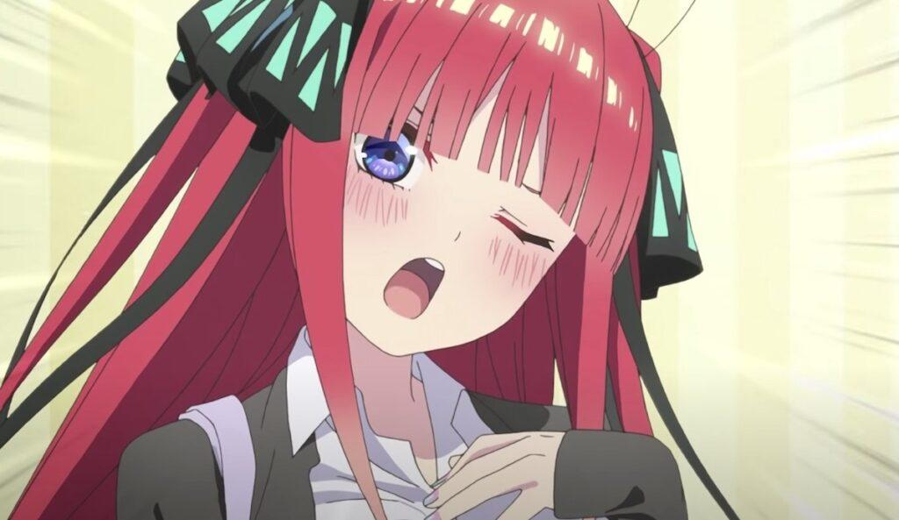
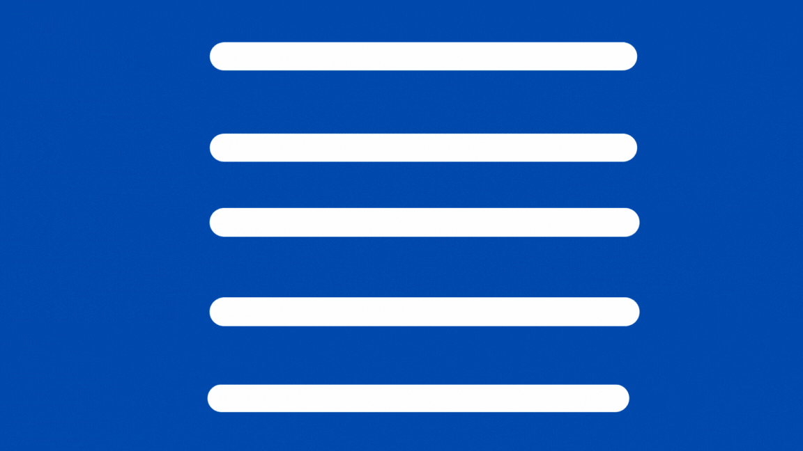

    </img>
    
Welcome to my profile. I'm Hu6Thi3n, a Fullstack Developer and Server Minecraft developer (for now)

    
---

    <h2>My Skills</h2>
    </img>
    
I am a fast learner so I also can code in other languages if needed (I just need documentation)

---

<h2> My Stats </h2>
<a href="https://github.com/anuraghazra/github-readme-stats">
    </img>
    
</a>

---

<h2>Contact Me</h2>

